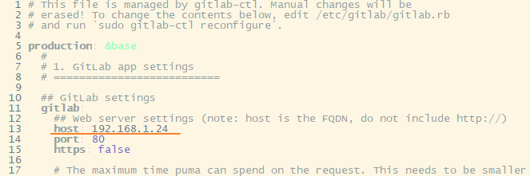

# GitLab

## 安装网站：

[ubuntu/focal/gitlab-ce_14.6.5-ce.0_amd64.deb - gitlab/gitlab-ce · packages.gitlab.com](https://packages.gitlab.com/gitlab/gitlab-ce/packages/ubuntu/focal/gitlab-ce_14.6.5-ce.0_amd64.deb)

或者直接下载 deb 包，然后执行

```bash
sudo dpkg -i path_to_deb_file
```

## SWAP 分区

命令 free 查看 swap 分区，显示全零为未开启

```bash
[root@yoyo sbin]# free
total        used        free      shared  buff/cache   available
Mem:        3881692     3219200      369316       52184      293176      360244
Swap:             0           0           0
```

创建 swap 大小为 bs*count=4294971392 (4G)

```bash
dd if=/dev/zero of=/mnt/swap bs=512 count=8388616
```

通过 mkswap 命令将上面新建出的文件做成 swap 分区

```bash
mkswap /mnt/swap
```

vim 编辑 /etc/sysctl.conf，加入以下内容：

```bash
vm.swappiness = 60
net.ipv4.neigh.default.gc_stale_time=120
```

修改文件权限为 600：

```bash
chmod 600 /mnt/swap
```

启用分区：

```bash
swapon /mnt/swap
```

开机自动启用：

```bash
echo “/mnt/swap swap swap defaults 0 0” >> /etc/fstab
```

再次输入 free 查看：

```bash
root@instance-v7jtqjmo:~# free
total        used        free      shared  buff/cache   available
Mem:        2048060     1693380       68764       29220      285916      154608
Swap:       4194304      721644     3472660
```

可以看到 swap 分区已经启动了

删除分区：

```bash
swapoff /mnt/swap
rm -f /mnt/swap
```

## sudo echo

```bash
echo 'deb blah ... blah' | sudo tee -a /etc/apt/sources.list > /dev/null
```

## SMTP

```bash
gitlab_rails['smtp_enable'] = true
gitlab_rails['smtp_address'] = "smtp.qq.com"
gitlab_rails['smtp_port'] = 465
gitlab_rails['smtp_user_name'] = "xxx@qq.com"
gitlab_rails['smtp_password'] = "开通smtp时返回的字符"
gitlab_rails['smtp_domain'] = "qq.com"
gitlab_rails['smtp_authentication'] = "login"
gitlab_rails['smtp_enable_starttls_auto'] = true
gitlab_rails['smtp_tls'] = true

user['git_user_email'] = "xxx@qq.com"
gitlab_rails['gitlab_email_from'] = 'xxx@qq.com'
```

```bash
gitlab_rails['smtp_enable_starttls_auto'] = true
gitlab_rails['smtp_tls'] = true
gitlab_rails['smtp_openssl_verify_mode'] = 'none'
```

```bash
gitlab-ctl reconfigure
```

测试：

```bash
gitlab-rails console
Notify.test_email('597909123@qq.com','test','GitLab test').deliver_now
```

## 初始密码

用户：root

密码：/etc/gitlab/initial_root_password

## 开放指定端口

```bash
sudo iptables -I INPUT -p tcp --dport 8000 -j ACCEPT
sudo iptables-save

# 永久保存
sudo apt-get install iptables-persistent
sudo netfilter-persistent save
sudo netfilter-persistent reload
```

## 迁移

目标服务器 gitlab 版本必须和源服务器 gitlab 版本一致。

### 源服务器执行操作

- 查看版本号
    
    ```bash
    cat /opt/gitlab/embedded/service/gitlab-rails/VERSION
    ```
    
- 备份，文件生成在 /var/opt/gitlab/backups 下，自动生成文件名文件名如 1614232417_2021_02_25_12.8.7_gitlab_backup.tar
    
    ```bash
    gitlab-rake gitlab:backup:create RAILS_ENV=production
    ```
    
- 目标服务器执行操作
    
    ```bash
    chmod 755 1599223012_gitlab_backup.tar
    gitlab-rake gitlab:backup:restore RAILS_ENV=production BACKUP=1599223012
    ```
    
- 手动迁移 gitlab.rb 和 gitlab-secrets.json：
    
    gitlab.rb 路径：/etc/gitlab/gitlab.rb
    
    gitlab-secrets.json 路径：/etc/gitlab/gitlab-secrets.json
    
- 修改 IP
    
    /opt/gitlab/embedded/service/gitlab-rails/config/gitlab.yml
    
    
    
    /etc/gitlab/gitlab.rb
    
    
    

- 重载配置：
    
    ```bash
    gitlab-ctl reconfigure
    ```
    
- 重启服务：
    
    ```bash
    gitlab-ctl restart
    ```