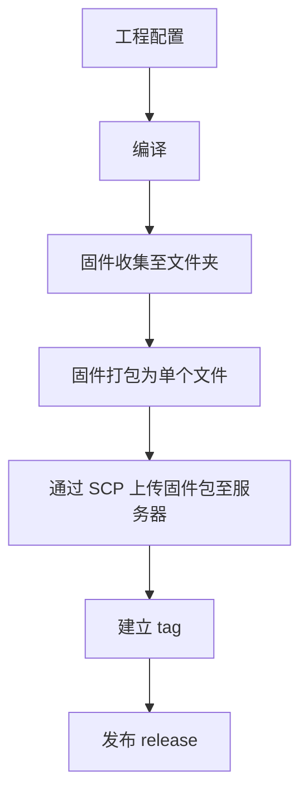

# 固件发布

## 流程

## 工程配置
## 编译
## 固件收集至文件夹
## 固件打包为单个文件
```powershell
Bandizip.exe c .\sample.zip .\src1\ .\src2\
```

## 通过 SCP 上传固件包至服务器
```powershell
scp .\firmware huqf@192.168.1.24:/home/huqf/www/firmware.com
```

## 建立 tag
```bash
curl --request POST --header "PRIVATE-TOKEN: <your_access_token>" "https://gitlab.example.com/api/v4/projects/5/repository/tags?tag_name=test&ref=master"
```

## 发布 release


## markdown

mermaid

```c
#include "stdio.h"

void main(void)
{
	printf("helloworld\n");
}
```


