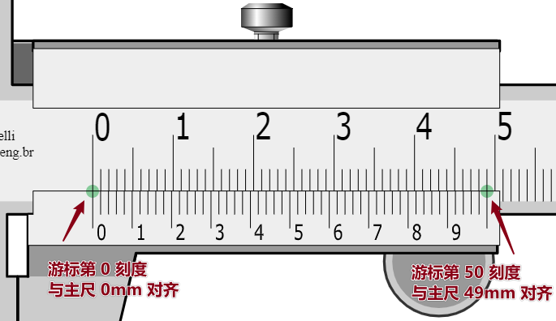

# 游标卡尺读数

## 游标卡尺在线模拟

[www.stefanelli.eng.br](http://www.stefanelli.eng.br)

## 游标卡尺初始状态

初始状态，游标 0 刻度与主尺 0 刻度对齐，游标 50 刻度与主尺 49 刻度（49mm）对齐，即游标总长 49mm。

游标共 50 格，因此游标每格长度为：$49mm / 50 = 0.98mm$。

游标每格长度（0.98mm）比主尺每格长度（1mm）短 0.02mm。

## 游标与主尺的关系

可以推出，游标 0 刻度和主尺 0 刻度对齐时：
	游标的第 0 刻度比主尺的第 0 刻度少 0.00mm；
	游标的第 1 刻度比主尺的第 1 刻度少 0.02mm；
	游标的第 2 刻度比主尺的第 2 刻度少 0.04mm；
	游标的第 3 刻度比主尺的第 3 刻度少 0.06mm；
	游标的第 n 刻度比主尺的第 n 刻度少 $n * 0.02mm$。

进一步，当游标的 A 刻度与主尺的 B 刻度对齐时：
	游标 A 刻度比主尺 B 刻度少 0.00mm；
	游标 A + 1 刻度比主尺 B + 1 刻度少 0.02mm；
	游标 A + 2 刻度比主尺 B + 2 刻度少 0.04mm；
	游标 A + 3 刻度比主尺 B + 2 刻度少 0.06mm；
	游标 A + n 刻度比主尺 B + n 刻度少 $n * 0.02mm$。

同时：
	游标 A 刻度比主尺 B 刻度多 0.00mm；
	游标 A - 1 刻度比主尺 B - 1 刻度多 0.02mm；
	游标 A - 2 刻度比主尺 B - 2 刻度多 0.04mm；
	游标 A - 3 刻度比主尺 B - 3 刻度多 0.006mm；
	游标 A - n 刻度比主尺 B - n 刻度多 $n * 0.02mm$。

## 被测物长度

因为初始状态时游标 0 刻度与主尺 0 刻度对齐，因此被测物长度应为**卡尺左臂与游标 0 刻度之间**的长度。

## 游标卡尺读数

以上图为例，容易读出主尺部分为 32mm。要读出准确被测长度，关键要知道**主尺 32mm 刻度和游标 0 刻度之间的距离**。

设主尺读数为 $x$，主尺读数刻度与游标 0 刻度之间距离为 $y$，则被测长度为 $z = x + y$，其中 $0mm < y < 1mm$。

由观察知道游标第 19 刻度与主尺刻度 51mm 对齐。

由前面的结论可以推出：
	第 19 刻度与任一主尺刻度**向后偏差的小数部分**为 0.00mm；
	第 18 刻度与任一主尺刻度向后偏差的小数部分为 0.02mm；
	第 17 刻度与任一主尺刻度向后偏差的小数部分为 0.04mm；
	第 n 刻度与任一主尺刻度向后偏差的小数部分为 $(19 - n) * 0.02mm$。

在此例中，游标 0 刻度在主尺 32mm 刻度之后的长度 $y = (19-0) * 0.02mm = 0.38mm$。

**最终读数：**$z = x + y = 32mm+0.38mm=32.38mm$。