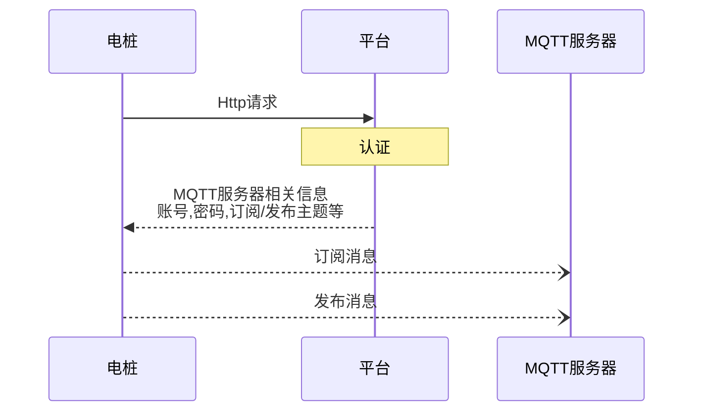

## 运维平台汽车充电桩通信协议


### 修正历史

| 版本 |    日期    |  作者  | 修订说明 |
| :--: | :--------: | :----: | -------- |
| V0.1 | 2022/09/15 | cRyann | 初始文档 |
|      |            |        |          |


[TOC]


### 概述

​	本协议规定了充电桩与运维平台之间数据交互的流程、格式和内容。协议整体依据国网104充电桩规约，新增数据部分协议参照 GBT-27930 对充电桩充电过程中与运维平台的交互数据进行了补充，本协议适用于交直流，交流在本协议中部分数据无需上送数据项在下面协议部分均有标注。

​	充电桩和充电运营管理系统之间的通信接口采用基于`MQTT`的通信方式实现，按照长连接工作模式。两个系统可部署在同一个或者不同的企业网络环境中，可以通过局域网或者互联网实现互相连接通信。充电桩通信联接方式支持有线网络接口、无线 GPRS 连接运营平台服务器或者多个充电桩经过集中器与运营平台连接。

#### 协议要求

> **数据字符集**：UTF-8； **数据规格**：JSON；

### 协议结构

> **报文消息方向: ** **`>>`** 表示 设备到平台 ;  **`<<`** 表示 平台到设备;

协议主要以两部分组成`消息头` 和`消息体` 如:

```json
{
	"header": {
		"version": "协议版本",
		"sessionId": "消息id", // 消息唯一标识,且应当包含时间戳
       "type":"消息类型"// properties,control,event
		"command": "业务标识"
	},
	"payload": {
        //...
    }
}
```

> 说明:
>
> |  Type值  | 说明                                     |
> | :------: | ---------------------------------------- |
> | property | 表示设备属性的读写; 如读取设备运行状态等 |
> | control  | 表示平台对设备的控制指令;如远程开电      |
> |  event   | 表示设备主动反馈的事件;如告警,主动开电等 |

#### topic主题说明

> server/{modelId}/{pileId} : 设备订阅  平台发布
>
> device/{modelId}/{pileId} : 平台订阅  设备发布

#### 设备上线与认证(http

设备上线时,需进行一次http的请求用于校验合法性与获取上线所需的信息;

上线流程如下:




接口地址:

```shell
curl -H "Content-Type: application/json" -X POST -d '{"modelCode": "123456789", "pileCode":"123456789"}' "<域名>/xxx/model/getIotMqttInfo"
```

请求参数Body JSON格式如下:

>```json
>{
>	"modelCode": "型号编码",
>	"pileCode": "电桩编码"//非必填
>}
>```

返回内容JSON格式:

>`成功`:
>
>```json
>{
>	"msg": "操作成功",
>	"code": 200,
>	"data": {
>		"username": "用户名",
>		"password": "密码",
>		"host": "服务地址",
>		"port": "服务端口",
>		"subTopic": "订阅主题",// 平台服务发布主题,设备订阅主题
>		"pulTopic": "发布主题" // 平台服务订阅主题,设备发布主题
>	}
>}
>```
>
>`失败`:
>
>```json
>{
>	"msg": "该型号未配置协议,或协议已停用",
>	"code": 500
>}
>```
>

加解密方法 AES/ECB/PKCS7Padding  测试地址:https://the-x.cn/cryptography/Aes.aspx

key请联系平台负责人获取

#### 设备离线>>

遵循MQTT协议的遗嘱消息,Will Retain = false、Will QoS = 0、Will Topic与普通报文基本一致,报文格式如下:

```json
{
	"header": {
		"version": "协议版本",
		"sessionId": "消息id",
       "type":"properties",
		"command": "offline"
	},
	"payload": {}
}
```

`平台无需答复`>>

### 通用消息

#### 通用答复消息: >> 或 <<

```json
{
	"header": {
		"version": "协议版本",
		"sessionId": "UUID",//与答复对象消息中的messageId相同
       "type":"property"//与答复对象消息中的type相同
		"command": "reply",//通用答复标识
	},
	"payload": {
	}
}
```

### 设备属性

#### 读取设备属性<<

```json
{
	"header": {
		"version": "协议版本",
		"sessionId": "消息id",
       "type":"property"
		"command": "read"
	},
	"payload": {"attributes":["hardwareMalfunction","state"] //要读取到属性列表
    }
}
```

回复消息格式>>

```json
{
	"header": {
		"version": "协议版本",
		"sessionId": "消息id",//与答复对象消息中的messageId相同
       "type":"property"
		"command": "readReply"
	},
    //成功
	"payload": {
      "success":true
		"hardwareMalfunction": 0,//硬件故障
		"state": 3 //状态
	}
    //失败
    "payload": {
		"success":false,
    	"code":"error_code",
    	"message":"失败原因"
	}
}
```

#### 修改设备属性<<

```json
{
	"header": {
		"version": "协议版本",
		"sessionId": "消息id",
       "type":"property"
		"command": "write"
	},
	"payload": {"state": 1} //要设置的属性
}
```

回复消息格式>>

```json
{
	"header": {
		"version": "协议版本",
		"sessionId": "消息id",//与答复对象消息中的messageId相同
       "type":"property"
		"command": "writeReply"
	},
	"payload": {
    "success":true
    } //要设置的属性
}
```

#### 设备属性上报>>

周期上送、变位上送、召唤

```json
{
	"header": {
		"version": "协议版本",
		"sessionId": "消息id",
       "type":"property"
		"command": "report"
	},
	"payload": {
		"lossOfChargeDegree": 0,//计损充电度数
		"degreeOfCharge": 0,//充电度数
		"soc": 0,//SOC
		"cumulativeChargingTime": 0,//累计充电时间(秒)
		"chargedAmount": 0,//已充金额
		"hardwareMalfunction": 0,//硬件故障
		"isTheGunInPlace": 2,//枪是否归位
		"whetherToInsertAGun": 1,//是否插枪
		"transactionSerialCode": "40100010001002022022083016373435",//交易流水号
		"outputCurrent": 0,//输出电流
		"gunLineTemperature": 0,//枪线温度
		"batteryPackMaximumTemperature": 0,//电池组最高温度
		"gunCode": "02",//枪号
		"gunWireCode": 0,//枪线编码
		"state": 3, //状态
		"outputVoltage": 0,//输出电压
		"timeLeft": 0//剩余时间(秒)
	}
}
```

可不回复消息格式<<

```json
// 通用答复消息
```

### 设备方法控制

#### 开电<<

```json
{
	"header": {
		"version": "协议版本",
		"sessionId": "消息id",
       "type":"control"
		"command": "open"
	},
	"payload": {
		"gunCode": "02"//枪号
        ...
	}
}
```

回复消息格式>>

```json
{
	"header": {
		"version": "协议版本",
		"sessionId": "消息id",
       "type":"control"
		"command": "openReply"
	},
	"payload": {
		"success":true
	}
}
```

#### 关电<<

```json
{
	"header": {
		"version": "协议版本",
		"sessionId": "消息id",
       "type":"control"
		"command": "close"
	},
	"payload": {
		"gunCode": "01"//枪号
        ...
	}
}
```

回复消息格式>>

```json
{
	"header": {
		"version": "协议版本",
		"sessionId": "消息id",
       "type":"control"
		"command": "closeReply"
	},
	"payload": {
		"success":true
	}
}
```

#### 更新固件命令<<

```json
{
	"header": {
		"version": "协议版本",
		"sessionId": "消息id",
       "type":"control"
		"command": "upgrade"
	},
	"payload": {
		"version": ""//新版本版本号
	}
}
```

回复消息格式>>

```json
{
	"header": {
		"version": "协议版本",
		"sessionId": "消息id",
       "type":"control"
		"command": "upgrade"
	},
	"payload": {
		...
	}
}
```

### 设备事件

#### 电桩开电>>

```json
{
	"header": {
		"version": "协议版本",
		"sessionId": "消息id",
		"command": "eventError"
	},
	"payload": {
		//...
	}
}
```

回复消息格式<<

```JSON
//通用答复消息
```

#### 电桩关电>>

```json
{
	"header": {
		"version": "协议版本",
		"sessionId": "消息id",
		"command": "eventError"
	},
	"payload": {
		//...
	}
}
```

回复消息格式<<

```JSON
//通用答复消息
```

#### 错误报文>>

```json
{
	"header": {
		"version": "协议版本",
		"sessionId": "消息id",
		"command": "eventError"
	},
	"payload": {
       "gunCode": "错误描述",//错误描述
		"errorMsg": "错误描述",//错误描述
       "errorLevel": "错误等级" //错误等级
	}
}
```

回复消息格式<<

```JSON
//通用答复消息
```

#### 拉取固件更新>>

设备主动向平台拉取新的固件版本

```

```

回复消息格式<<

```

```


